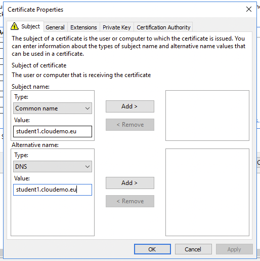

<br><br>
<br><br>
<br><br>

# AWS Federated Authentication with AD FS
## LAB Overview

### AD FS federated authentication process - HOW it works?

The following process details how a user would authenticate to AWS using Active Directory and AD FS:

Step 1\. The flow is initiated when a user browses to the AD FS sample site ( [https://Fully.Qualified.Domain.Name.Here/adfs/ls/IdpInitiatedSignOn.aspx](https://Fully.Qualified.Domain.Name.Here/adfs/ls/IdpInitiatedSignOn.aspx) ) inside their domain. When you install AD FS, you get a new virtual directory named AD FS for your default website, which includes this page.

Step 2\. The sign-on page authenticates the user against Active Directory. Depending on the user's browser, they might be prompted for their Active Directory username and password.

Step 3\. The user's browser receives a SAML assertion in the form of an authentication response from AD FS.

Step 4\. The user's browser posts the SAML assertion to the AWS sign-in endpoint for SAML ( [https://signin.aws.amazon.com/saml](https://signin.aws.amazon.com/saml) ). Behind the scenes, sign-in uses the AssumeRoleWithSAML API to request temporary security credentials and then constructs a sign-in URL for the AWS Management Console.

Step 5\. The user's browser receives the sign-in URL and is redirected to the console.


## Task 1: Prepare your server.

In this task you will launch a Windows Server 2016 machine with Active Directory installed.

1. On the **Services** menu, click **EC2**.
2. Click **Launch Instance**.
3. In the navigation pane on the left, click My AMIs
4. Select **ADFS-template**.
5. On the **Choose an Instance Type** page, select the **t3a.large** instance type, which should be enough for this machine.
6. On the **Configure Instance Details** page provide the following information:
   * **Number of instance**: 1
   * **Network:** use default VPC
   * **Subnet**: leave default subnet...
   * **Auto-assign Public IP**: Enable
7. Click **Next: Add Storage**. 
8. Click **Next: Add Tags** to accept the default storage device configuration. 
9. On the **Add Tags** page, click **Add Tag,** type a **Name** for a Key box and studentX_ADFS in the Value box.
10. Click **Next: Configure Security Group**.
11. Choose **Create a new security Group**, configure the following:
    *  **Security group name:** studentX_ADFS
    *  **Description**: StudentX ADFS Servers Security Group
    *  **Type**: RDP, **Protocol**: TCP, **Port Range:**: 3389, **Source**: 0.0.0.0/0
    *  **Type**: DNS (TCP), **Protocol**: TCP, **Port Range:**: 53, **Source**: 0.0.0.0/0
    *  **Type**: DNS (UDP), **Protocol**: UDP, **Port Range:**: 53, **Source**: 0.0.0.0/0
    *  **Type**: HTTPS, **Protocol**: TCP, **Port Range:**: 443, **Source**: 0.0.0.0/0
    *  **Type**: Custom TCP, **Protocol**: TCP, **Port Range:**: 88, **Source**: 0.0.0.0/0
12. Click **Review and Launch**.
13. Click **Launch**.
14. In the key pair dialog box, select **Proceed without a key pair**
15. Click **Launch Instances**.


## Task 2: Connect to the ADFS instance over RDP.


1. Using any RDP client of youe choice connect to the server. Use following credentials:
* user: **Administrator**
* password: `=Hp4aRf3@y*j2kxH*)xZLeqWA;l@IprS`


## Task 3: Create a self-signed certificate on ADFS Server

1. Open Microsoft Management Console by using *mmc* command.
2. Select **File**->**Add/Remove Snap-In**.
3. Select **Certificates**.

4. Click **Add**.
5. Select *Computer account* ancl click **Next**.

6. Click **Finish**.
7. Click **OK**.
8. Unwind *Certificates* tree and rightclick on **Certificates**.
9. Select **All Tasks** and **Request New Certificate**.

10. Click **Next**.
11. Click **Next**.
12. Click on **More information...**.

13. Select *Common Name* as **Subject Name** and enter your domain **studentX.labs1.cloudemo.eu**.
14. Select *DNS* as **Alternative name**.

15. Add both values

16. Click **OK**
17. Select **Web Server** and click **Enroll**.
18. click **Finish**.

## Task 4: Configure AD FS


1. From Windows Menu open **Server Manager**
2. Click the **Configure the federation service on this server** link.


1.  On the **Welcome** page, make sure **Create the first federation server in a federation server farm** is selected. Then, click **Next** .

2.  Click **Next** .
3. Select the SSL certificate you created in previous task.

4.  For **Federation Service Display Name** , enter `studentXadfs`

3.  Click **Next** .

4.  On the **Specify Service Account** page, click **Select** .

5.  For **Enter the object name to select** , enter `cloudemo`

6.  Click **Check Names** , and then click **OK** .

7.  For **Account Password** , enter `=Hp4aRf3@y*j2kxH*)xZLeqWA;l@IprS`

8.  Click **Next** .

9.  On the **Specify Configuration Database** page, click **Next** .

10. On the **Review Options** page, review your options, and then click **Next** .

11.  On the **Pre-requisite Checks** page, click **Configure** .

## Task 5: Add DNS Record in Route53

Before you proceed next step add a dns entry in domain that is prepared for this laboratory. Depends of the account there is a hosted zone labs1.cloudemo.eu or labs2.cloudemo.eu in the Route53

1. On the **Services** menu, click **EC2**.
2. In the **Description** tab of your studentX_ADFS instance, copy the **Public IPs** value to your text editor.
3. Go to the **Route53** Console. (Services menu > Route53).
4. In the navigation pane on the left, click **Hosted zones**.
5. Click the domain name: **labs1(or labs2).cloudemo.eu**.
6. In the **Create Record Set** window on the right, configure the following:
   * **Name**: studentX 
   * **Type**: A-IPv4 address 
   * **Alias**: No 
   * **TTL (Seconds)**: 60 
   * **Value**: Paste the Public IP value that you copied to your text editor 
   * **Routing Policy**: Simple 
   * Click **Create**
7. Close the Route53 Console.


## Task 6: Set up AWS IAM to work with AD FS

At first download metadata file which is necessary for Identity Provider configuration.

1. Open web browser on you local machine.
2. Paste the url:

`https://studentX.labs1.cloudemo.eu/FederationMetadata/2007-06/FederationMetadata.xml`

You should get or automatically download a file **federationmetadata.xml** into you Download Folder.

3.  In the AWS Management Console, click **Services** , and click **IAM** .
4.  In the left navigation pane, click **Identity providers** .
5.  Click **Create Provider** .
6.  Configure the following:
*   **Provider Type:** Select **SAML**
*   **Provider Name:** studentX_ADFS

1.  Click **Choose File** .

2.  Browse to and select the _FederationMetadata.xml_ file that you saved earlier.

3.  Click **Next Step** .

4.  Click **Create** .

For this lab you will prepare IAM Role for ADFS. This role will grant ReadOnly Access to the AWS Console.

5. In the navigation pane on the left, click **Roles**.
6. Click **Create role** button.
7. For **Select type of trusted entity** choose the **SAML 2.0 federation**.
8. In **Choose a SAML 2.0 provider** section fill followin:
    * SAML provider: Select your provider studentX_ADFS
    * Select: Allow programmatic and AWS Management Console access
9. Click **Next:Permissions**.
10. Search for `ReadOnlyAccess` policy and select it.
11. Click **Next:Tags** and **Next:Review**.
12. Provide Role name: **AWS-studentX_RO** (use AWS- at the beggining)
13. Click **Create role**.

## Task 7: Set up AWS as a trusted relying party

1.  Return to the RDP session with the AD FS instance, and open Server Manager.
2.  In the left navigation pane, click **Local Server** .
3.  In the **PROPERTIES** section to the right, for **IE Enhanced Security Configuration** , click the **On** link.
4.  For both **Administrators** and **Users** , select **Off** , and then click **OK** .
5.  Click **Tools** > **AD FS Management** .

**Note** The **Tools** menu is at the top-right corner of the Server Manager dashboard.

6.  In the **Actions** pane on the right, click **Add A Trusted Relying Party** .

**Note** You can also click **Required: Add a trusted relying party** in the **Overview** section.

7.  On the **Welcome** page, click **Start** .
8.  On the **Select Data Source** page, confirm that **Import data about the relying party published online or on a local network** is selected.

9.  For **Federation metadata address (host name or URL)** , enter `https://signin.aws.amazon.com/static/saml-metadata.xml`

10. Click **Next** .

11. On the **Specify Display Name** page, click **Next** .

12. On the **Choose Access Control Policy** page, click **Next** .

13. On the **Ready to Add Trust** page, click **Next** .

14. On the **Finish** page, select **Configure claims issuance policy for the application** .

15. Click **Close** .

### Configure claim rules for the AWS relying party

In this section, you will add and configure claim rules, which ensure that elements such as NameId, RoleSessionName, and Roles are added to the SAML authentication response. AWS requires these elements; AD FS does not provide them by default.

16.  In the **AD FS Management** area of Server Manager, in the left navigation pane, click the **Relying Party Trusts** folder.

**Note** To access the AD FS Management area of Server Manager, click **Tools** > **AD FS Management** . The **Tools** menu is at the top-right corner of the Server Manager dashboard.

17. In the **Actions** pane on the right, click **Edit Claim Issuance Policy**
18. Click **Add Rule** .
19. For **Claim rule template** , select **Transform an Incoming Claim** .
20. Click **Next** .
21. On the **Configure Claim Rule** page, configure the following:

*   **Claim rule name:** Enter `Name ID`
*   **Incoming claim type:** Select **Windows account name**
*   **Outgoing claim type:** Select **Name ID**
*   **Outgoing name ID format:** Select **Persistent Identifier**

22. Click **Finish** .
23. Click **Add Rule** again.
24. For **Claim rule template** , select **Send LDAP Attributes as Claims** .
25. Click **Next** .
26. On the **Configure Claim Rule** page, configure the following:
*   **Claim rule name:** Enter `RoleSessionName`
*   **Attribute store:** Select **Active Directory**
*   **LDAP Attribute:** Select **SAM-Account-Name**
*   **Outgoing Claim Type:** Enter `https://aws.amazon.com/SAML/Attributes/RoleSessionName`

27. Click **Finish** .
28. Click **Add Rule** for the third time.
29. For **Claim rule template** , select **Send Claims Using a Custom Rule** .
30. Click **Next** .
31. On the **Configure Claim Rule** page, configure the following:
*   **Claim rule name:** Enter `Get AD Groups`
*   **Custom rule:** Copy and paste the following:

````
c:[Type == "http://schemas.microsoft.com/ws/2008/06/identity/claims/windowsaccountname", Issuer == "AD AUTHORITY"] => add(store = "Active Directory", types = ("http://temp/variable"), query = ";tokenGroups;{0}", param = c.Value);
````

This rule uses the standard Active Directory schema to identify user groups from Active Directory and pass them to IAM.

32. Click **Finish** .

**Note** Leave the **Edit Claim Issuance Policy** window open.

33. In the AWS Management Console, click **Services** , and click **IAM** .
34. In the left navigation pane, click **Identity providers** .
35. Click the Provider Name for the your Identity provider.

**Note** Click the Provider Name, not the checkbox next to the provider.

36. Copy the **Provider ARN** value and save it to use later.

**Note** The value should look similar to the following:  
*arn:aws:iam::999999999999:saml-provider/studentX_ADFS*

37. In the left navigation pane, click **Roles** .
38. Click the Role name you created **studentX_ADFS_RO**.
39. Copy the **Role ARN** value and save it to use later.

**Note** The value should look similar to the following:  
*arn:aws:iam::999999999999:role/AWS-studentX_RO*

40.  In your text editor, delete the part of the word **studentX_RO** from the end of the role ARN.

**Note** The value should now look similar to the following: _arn:aws:iam::036275514250:role/AWS-

41.  Return to the RDP session of your AD FS instance.
42.  In the **Edit Claim Issuance Policy** window, click **Add Rule** .

**Note** If you closed this window, follow these steps to open it:

*   Within Server Manager, click **Tools** > **AD FS Management**
*   In the left navigation pane, click the **Relying Party Trust** folder
*   In the **Actions** pane on the right, click **Edit Claim Issuance Policy**

43. For **Claim rule template** , select **Send Claims Using a Custom Rule** .
44. Click **Next** .
45. On the **Configure Claim Rule** page, configure the following:

*   **Claim rule name:** Enter `Roles`
*   **Custom rule:** Copy and paste the following:

`c:[Type == "http://temp/variable", Value =~ "(?i)^AWS-"] => issue(Type = "https://aws.amazon.com/SAML/Attributes/Role", Value = RegExReplace(c.Value, "AWS-", "SAMLARN,ROLEARN"));`

46.  In the pasted text, replace **SAMLARN** with the provider ARN value you saved earlier. Replace **ROLEARN** with the role ARN value that you saved earlier.

**Note** Check that you have removed the word **Production** from the end of the role ARN.

The custom rule text should now look similar to the following:

`c:[Type == "http://temp/variable", Value =~ "(?i)^AWS-"] => issue(Type = "https://aws.amazon.com/SAML/Attributes/Role", Value = RegExReplace(c.Value, "AWS-", "arn:aws:iam::036275514250:saml-provider/ADFS,arn:aws:iam::036275514250:role/AWS-"));`

47.  Click **Finish** , and then click **OK** .
48.  Close the **AD FS Management** window, and close **Server Manager** .
49. On the AD FS instance desktop, open PowerShell and run the following command to open the **Network Connections** window: `Set-AdfsProperties –EnableIdpInitiatedSignonPage $True`

**CREATE USER AND GROUP**

50. From Menu start open **Windows Administrative Tools** and **Active Directory Users and Computers**.
51. From the left panel right click on Users then New ->Group.
52. Provide the same name for the group such as your IAM Role. ex. **AWS-student1_RO**
53. Click OK
54. Once again right-click on Users then New -> User.
55. Fill following fields:
   * First name: Your name
   * User logon name: studentx
55. Click **Next**.
56. Setup a password: ex. !Trudnehaslo123
57. Unselect: User must change password..... 
58. Click Next and Finish.
59. Doube-click on the user you just created.
60. Switch to Member Of tab and ad user the group you just created. 
61. Save all changes.

## Task 8: Test the configuration by logging into AWS

1.  On your computer open web browser
2.  Copy and paste the following URL in the address bar:

`https://studentX.labs1.cloudemo.eu/adfs/ls/IdpInitiatedSignOn.aspx`

**Note** If prompted that the connection is not private, click **Advanced** , and then click **Proceed to localhost (unsafe)** .

3.  Select **Sign in to one of the following sites** , and then click **Sign in**
4.  Enter the following values on the login page:

*   **User name:** Enter studentX@cloudemo.local
*   **Password:** Enter the `!Trudnehaslo123`

You are now signed in to the AWS Management Console as **AWS-studnetX_RO/studentX@cloudemo.local** .

5. In the console, click **Services** , and then click **EC2** .
6. In the left navigation, click **Instances** .

Try to create a S3 bucket. You are denied becouse of ReadOnly Access.

By creating IAM roles and AD FS groups, you are able to assign specific permissions to users to limit their access to appropriate parts of the AWS Management Console.

For reference, see the following detailed blog article on this topic (with Windows Server 2008 R2): [https://blogs.aws.amazon.com/security/post/Tx71TWXXJ3UI14/Enabling-Federation-to-AWS-using-Windows-Active-Directory-ADFS-and-SAML-2-0](https://blogs.aws.amazon.com/security/post/Tx71TWXXJ3UI14/Enabling-Federation-to-AWS-using-Windows-Active-Directory-ADFS-and-SAML-2-0)

## End Lab
